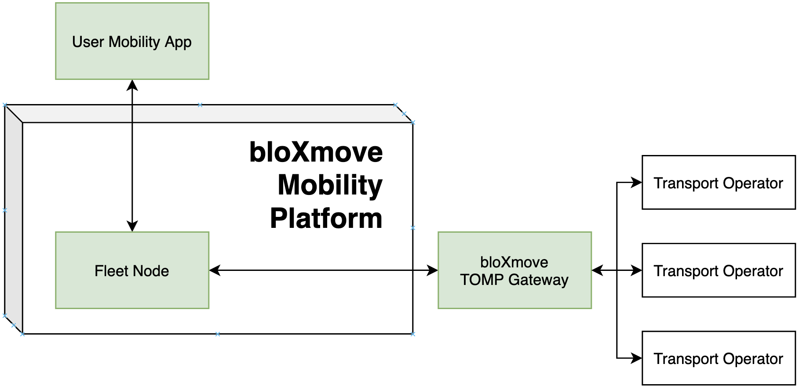

# bloXmove TOMP Gateway      


## Overview

The bloXmove TOMP Gateway is used to connect the bloXmove mobility platform with a transport-operator who implements the [TOMP-API](https://github.com/TOMP-WG/TOMP-API). The Gateway was designed to enable an onboarding to the bloXmove ecosystem with minimal effort. The Gateway currently contains the core essential functions for the complete booking of a fleet based mobility service. This service maps data which is coming from and going to the transport-operator in the expected data to the bloXmove fleet-node.

 

For testing purposes, there is an example tomp-transport-operator (1.0.0) running in AWS, which is currently connected to the gateway service (See .env file).

Due to some incompatibility issues regarding some missing fields in the tomp-api-version 1.0.0, we made some assumptions and used some meta-data fields. But these issues will be resolved in version 1.3.0. After this version is released, the TOMP-Gateway-Service will also be updated.



The bloXmove TOMP Gateway is translating calls from the fleet node in the bloXmove mobility platform to the transport-operator implementing the TOMP API.


The following endpoints are currently available:

## <u>Create Booking</u>

Endpoint: /create-booking

By providing an asset-id, this endpoint creates a planning and a booking at the tomp-transport-operator and returns a vehicle-contract with data expected by the bloXmove internal fleet-node. We here bridge between the TOMP logic which will always require any booking to be preceeded by a planning step and the bloXmove platform which does not neccesarily require such a planning step. 

The flow for calling this endpoint is documented in more detail in a sequence diagram below.


## <u>Confirm Booking</u>

**Endpoint:** <u>/confirm-booking</u>

By providing the booking-id from the vehicle-contract, this endpoint confirms a booking at the tomp-transport-operator.

## <u>Change Door Status</u>

**Endpoint:** <u>/change-door-status</u>

By providing the booking-id from the vehicle-contract and the door-status (OPEN or CLOSED), this endpoint sets the state of the associated leg in PAUSED or IN_USE at the tomp-transport-operator.

The flow for calling this endpoint is documented in more detail in a sequence diagram below.


## <u>End Booking</u>

**Endpoint:** <u>/end-booking</u>

By providing the booking-id from the vehicle-contract, this endpoint finishes a booking at the tomp-transport-operator.

The flow for calling this endpoint is documented in more detail in a sequence diagram below.


## <u>Service Catalog</u>

**Endpoint:** <u>/service-catalog</u>

If this endpoint is called, the tomp-gateway-service gets all available-assets from the tomp-transport-operator and maps the data to a format expected by the bloXmove internal fleet-node.

The flow for calling this endpoint is documented in more detail in a sequence diagram below.


# Getting started

Before running the app you need to copy the `.env.example`-file, paste it to the root folder and rename it to `.env`. You can modify the files content to your needs.

## Run

```
npm install
npm run start
```

## Run in dev mode

```
npm run start:dev
```

## Run unit tests

```
npm run test
```

## Generate TOMP interfaces

The TOMP interfaces can be auto-generated based on the latest specification [TOMP-API.yaml](https://raw.githubusercontent.com/TOMP-WG/TOMP-API/master/TOMP-API.yaml) on the master branch. You can generate it as follows:

```
npm run generate-tomp-interfaces
```

Regarding reference issues in the yaml file, you have to add "//@ts-nocheck" on the top of the generated file to disable the ts-check.

## Start via docker-compose

```sh
docker-compose up --build
```

## View the bloXmove TOMP gateway on swagger UI:

upon correct local deployment at:
 http://localhost:2900/api/

our reference Swagger:
 https://dev.mobilityblockchainplatform.io/bloxmove-tomp-gateway/api/

